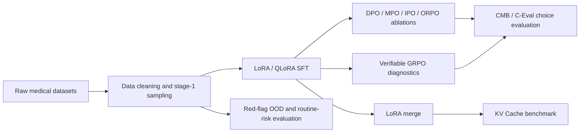

# Pipeline

```mermaid
flowchart LR
    A["Raw medical datasets"] --> B["Data cleaning and stage-1 sampling"]
    B --> C["LoRA / QLoRA SFT"]
    C --> D["DPO / MPO / IPO / ORPO ablations"]
    C --> E["Verifiable GRPO diagnostics"]
    D --> F["CMB / C-Eval choice evaluation"]
    E --> F
    B --> G["Red-flag OOD and routine-risk evaluation"]
    C --> H["LoRA merge"]
    H --> I["KV Cache benchmark"]
```

主评测关注医学选择题准确率。红旗症状部分作为安全响应审计，部署部分验证 LoRA 合并和 KV Cache 解码吞吐。
